# PlugQueue — Deep Architecture Wiki

> Privacy-first, community-driven EV charging queue management PWA.
> Vue 3 + Hono + Postgres/PostGIS + Redis on Railway.

---

## Table of Contents

1. [System Overview](#1-system-overview)
2. [Service Architecture](#2-service-architecture)
3. [Data Flow](#3-data-flow)
4. [Database Design](#4-database-design)
5. [Reactive Queue Engine](#5-reactive-queue-engine)
6. [API Surface](#6-api-surface)
7. [Frontend Architecture](#7-frontend-architecture)
8. [Privacy Model](#8-privacy-model)
9. [Deployment Topology](#9-deployment-topology)
10. [Queue State Machine](#10-queue-state-machine)
11. [Push Notification Flow](#11-push-notification-flow)
12. [OCR Pipeline](#12-ocr-pipeline)
13. [Rate Limiting & Anti-Abuse](#13-rate-limiting--anti-abuse)
14. [Failure Modes & Recovery](#14-failure-modes--recovery)
15. [Design System](#15-design-system)

---

## 1. System Overview

PlugQueue solves the "arrive and hope" problem at busy EV charging stations. Drivers join a virtual queue from their phone, get notified when a stall opens, and confirm they're plugging in — all without accounts, logins, or personal data storage.

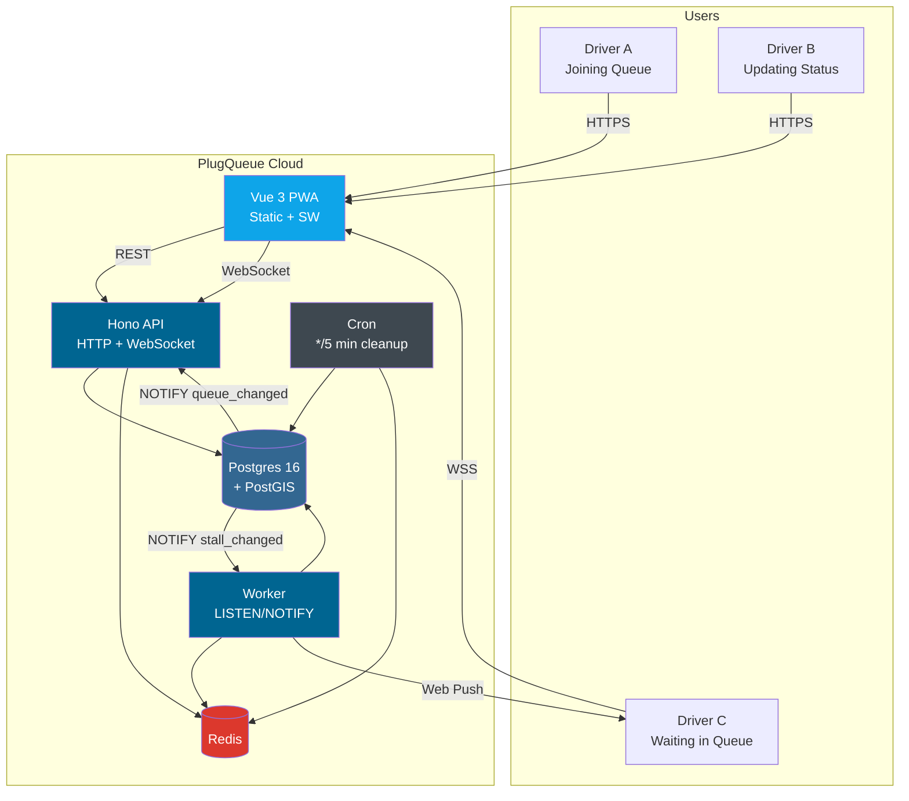
```mermaid
graph TB
    subgraph Users
        D1[Driver A<br/>Joining Queue]
        D2[Driver B<br/>Updating Status]
        D3[Driver C<br/>Waiting in Queue]
    end

    subgraph PlugQueue Cloud
        WEB[Vue 3 PWA<br/>Static + SW]
        API[Hono API<br/>HTTP + WebSocket]
        WRK[Worker<br/>LISTEN/NOTIFY]
        CRON[Cron<br/>*/5 min cleanup]
        PG[(Postgres 16<br/>+ PostGIS)]
        RD[(Redis)]
    end

    D1 -->|HTTPS| WEB
    D2 -->|HTTPS| WEB
    D3 -->|WSS| WEB

    WEB -->|REST| API
    WEB -->|WebSocket| API

    API --> PG
    API --> RD
    WRK --> PG
    WRK --> RD
    CRON --> PG
    CRON --> RD

    PG -->|NOTIFY stall_changed| WRK
    PG -->|NOTIFY queue_changed| API

    WRK -->|Web Push| D3

    style WEB fill:#0ea5e9,color:#fff
    style API fill:#006591,color:#fff
    style WRK fill:#006591,color:#fff
    style CRON fill:#3e4850,color:#fff
    style PG fill:#336791,color:#fff
    style RD fill:#dc382d,color:#fff
```

**Key design principles:**
- **No accounts.** Identity is a device hash + hashed license plate.
- **No polling.** Postgres `LISTEN/NOTIFY` triggers reactive queue advancement.
- **No server-stored images.** OCR runs on-device via Tesseract.js.
- **Sub-second notification.** Stall freed → trigger fires → worker notifies → push delivered.

---

## 2. Service Architecture

Five services run inside a single Railway project, communicating over Railway's private network (`*.railway.internal`).

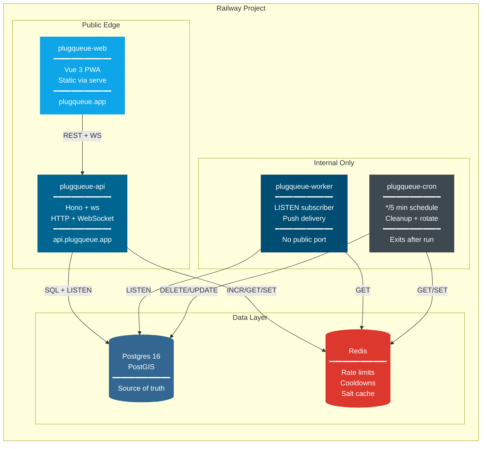
```mermaid
graph LR
    subgraph Railway Project
        direction TB

        subgraph Public Edge
            WEB["plugqueue-web<br/>━━━━━━━━━━━━━<br/>Vue 3 PWA<br/>Static via serve<br/>━━━━━━━━━━━━━<br/>plugqueue.app"]
            API["plugqueue-api<br/>━━━━━━━━━━━━━<br/>Hono + ws<br/>HTTP + WebSocket<br/>━━━━━━━━━━━━━<br/>api.plugqueue.app"]
        end

        subgraph Internal Only
            WRK["plugqueue-worker<br/>━━━━━━━━━━━━━<br/>LISTEN subscriber<br/>Push delivery<br/>━━━━━━━━━━━━━<br/>No public port"]
            CRON["plugqueue-cron<br/>━━━━━━━━━━━━━<br/>*/5 min schedule<br/>Cleanup + rotate<br/>━━━━━━━━━━━━━<br/>Exits after run"]
        end

        subgraph Data Layer
            PG[("Postgres 16<br/>PostGIS<br/>━━━━━━━━━━━━━<br/>Source of truth")]
            RD[("Redis<br/>━━━━━━━━━━━━━<br/>Rate limits<br/>Cooldowns<br/>Salt cache")]
        end
    end

    WEB -- "REST + WS" --> API
    API -- "SQL + LISTEN" --> PG
    API -- "INCR/GET/SET" --> RD
    WRK -- "LISTEN" --> PG
    WRK -- "GET" --> RD
    CRON -- "DELETE/UPDATE" --> PG
    CRON -- "GET/SET" --> RD

    style WEB fill:#0ea5e9,color:#fff,stroke:#0ea5e9
    style API fill:#006591,color:#fff,stroke:#006591
    style WRK fill:#004d73,color:#fff,stroke:#004d73
    style CRON fill:#3e4850,color:#fff,stroke:#3e4850
    style PG fill:#336791,color:#fff,stroke:#336791
    style RD fill:#dc382d,color:#fff,stroke:#dc382d
```

### Service Responsibilities

| Service | Runtime | Scaling Model | Restart Policy | Port |
|---------|---------|---------------|----------------|------|
| `plugqueue-web` | Static (serve) | Stateless, horizontal | ON_FAILURE | `$PORT` |
| `plugqueue-api` | Node 20 long-running | Stateful (WS conns) | ON_FAILURE (3x) | `$PORT` |
| `plugqueue-worker` | Node 20 long-running | Stateful (LISTEN conn) | ALWAYS | None |
| `plugqueue-cron` | Node 20 one-shot | N/A — runs and exits | NEVER | None |

**Why this split?**
- WebSocket connections and LISTEN subscriptions have different failure modes. If the worker crashes, WebSocket clients stay connected (and vice versa).
- The cron service is pure cleanup — it should never block the API or worker.
- Horizontal scaling of workers is safe because of `FOR UPDATE SKIP LOCKED`.

---

## 3. Data Flow

### 3.1 Join Queue Flow

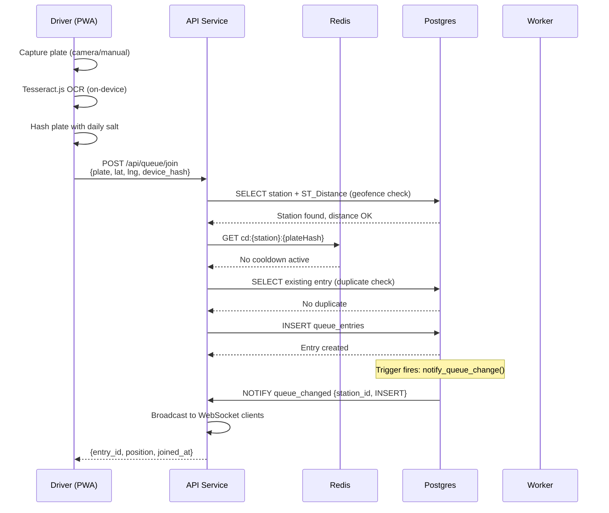
```mermaid
sequenceDiagram
    participant D as Driver (PWA)
    participant A as API Service
    participant R as Redis
    participant P as Postgres
    participant W as Worker

    D->>D: Capture plate (camera/manual)
    D->>D: Tesseract.js OCR (on-device)
    D->>D: Hash plate with daily salt
    D->>A: POST /api/queue/join<br/>{plate, lat, lng, device_hash}

    A->>P: SELECT station + ST_Distance (geofence check)
    P-->>A: Station found, distance OK

    A->>R: GET cd:{station}:{plateHash}
    R-->>A: No cooldown active

    A->>P: SELECT existing entry (duplicate check)
    P-->>A: No duplicate

    A->>P: INSERT queue_entries
    P-->>A: Entry created

    Note over P: Trigger fires: notify_queue_change()
    P->>A: NOTIFY queue_changed {station_id, INSERT}

    A->>A: Broadcast to WebSocket clients
    A-->>D: {entry_id, position, joined_at}
```

### 3.2 Stall Freed → Notification Flow

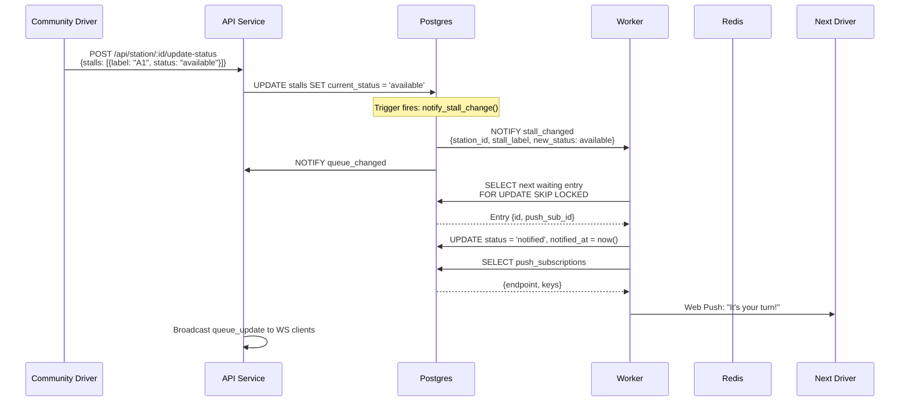
```mermaid
sequenceDiagram
    participant C as Community Driver
    participant A as API Service
    participant P as Postgres
    participant W as Worker
    participant R as Redis
    participant N as Next Driver

    C->>A: POST /api/station/:id/update-status<br/>{stalls: [{label: "A1", status: "available"}]}

    A->>P: UPDATE stalls SET current_status = 'available'
    Note over P: Trigger fires: notify_stall_change()

    P->>W: NOTIFY stall_changed<br/>{station_id, stall_label, new_status: available}
    P->>A: NOTIFY queue_changed

    W->>P: SELECT next waiting entry<br/>FOR UPDATE SKIP LOCKED
    P-->>W: Entry {id, push_sub_id}

    W->>P: UPDATE status = 'notified', notified_at = now()

    W->>P: SELECT push_subscriptions
    P-->>W: {endpoint, keys}

    W->>N: Web Push: "It's your turn!"

    A->>A: Broadcast queue_update to WS clients
```

### 3.3 Full Lifecycle

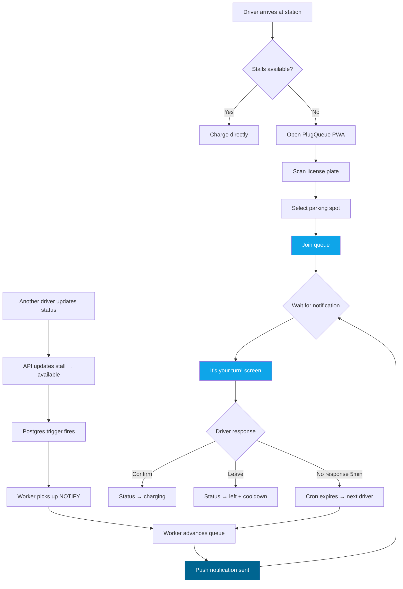
```mermaid
graph TD
    A[Driver arrives at station] --> B{Stalls available?}
    B -->|Yes| C[Charge directly]
    B -->|No| D[Open PlugQueue PWA]

    D --> E[Scan license plate]
    E --> F[Select parking spot]
    F --> G[Join queue]

    G --> H{Wait for notification}

    I[Another driver updates status] --> J[API updates stall → available]
    J --> K[Postgres trigger fires]
    K --> L[Worker picks up NOTIFY]
    L --> M[Worker advances queue]
    M --> N[Push notification sent]

    N --> H
    H --> O["It's your turn!" screen]
    O --> P{Driver response}
    P -->|Confirm| Q[Status → charging]
    P -->|Leave| R[Status → left + cooldown]
    P -->|No response 5min| S[Cron expires → next driver]

    S --> M

    style G fill:#0ea5e9,color:#fff
    style N fill:#006591,color:#fff
    style O fill:#0ea5e9,color:#fff
```

---

## 4. Database Design

### 4.1 Entity Relationship Diagram

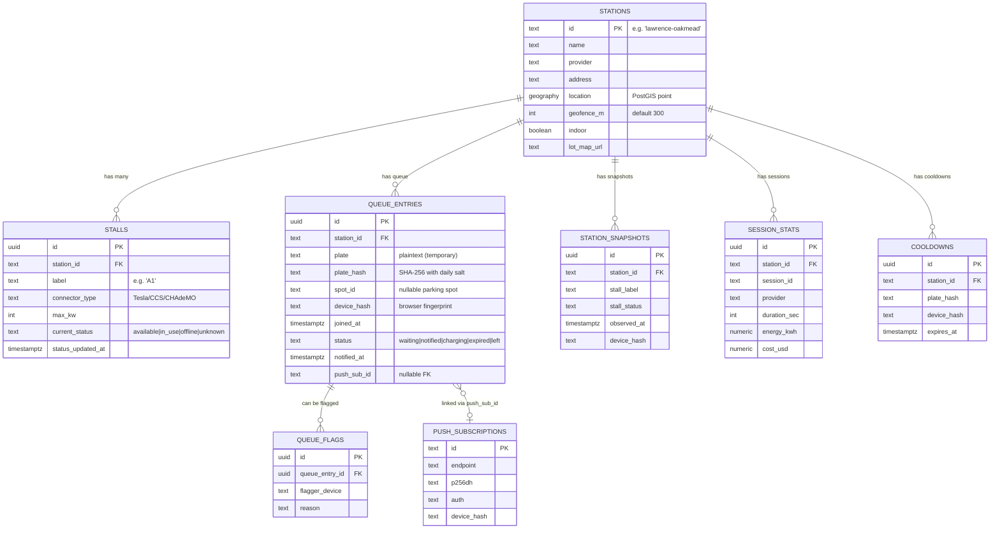
```mermaid
erDiagram
    STATIONS ||--o{ STALLS : "has many"
    STATIONS ||--o{ QUEUE_ENTRIES : "has queue"
    STATIONS ||--o{ STATION_SNAPSHOTS : "has snapshots"
    STATIONS ||--o{ SESSION_STATS : "has sessions"
    STATIONS ||--o{ COOLDOWNS : "has cooldowns"
    QUEUE_ENTRIES ||--o{ QUEUE_FLAGS : "can be flagged"
    QUEUE_ENTRIES }o--o| PUSH_SUBSCRIPTIONS : "linked via push_sub_id"

    STATIONS {
        text id PK "e.g. 'lawrence-oakmead'"
        text name
        text provider
        text address
        geography location "PostGIS point"
        int geofence_m "default 300"
        boolean indoor
        text lot_map_url
    }

    STALLS {
        uuid id PK
        text station_id FK
        text label "e.g. 'A1'"
        text connector_type "Tesla/CCS/CHAdeMO"
        int max_kw
        text current_status "available|in_use|offline|unknown"
        timestamptz status_updated_at
    }

    QUEUE_ENTRIES {
        uuid id PK
        text station_id FK
        text plate "plaintext (temporary)"
        text plate_hash "SHA-256 with daily salt"
        text spot_id "nullable parking spot"
        text device_hash "browser fingerprint"
        timestamptz joined_at
        text status "waiting|notified|charging|expired|left"
        timestamptz notified_at
        text push_sub_id "nullable FK"
    }

    STATION_SNAPSHOTS {
        uuid id PK
        text station_id FK
        text stall_label
        text stall_status
        timestamptz observed_at
        text device_hash
    }

    SESSION_STATS {
        uuid id PK
        text station_id FK
        text session_id
        text provider
        int duration_sec
        numeric energy_kwh
        numeric cost_usd
    }

    COOLDOWNS {
        uuid id PK
        text station_id FK
        text plate_hash
        text device_hash
        timestamptz expires_at
    }

    QUEUE_FLAGS {
        uuid id PK
        uuid queue_entry_id FK
        text flagger_device
        text reason
    }

    PUSH_SUBSCRIPTIONS {
        text id PK
        text endpoint
        text p256dh
        text auth
        text device_hash
    }
```

### 4.2 Key Indexes

| Table | Index | Purpose |
|-------|-------|---------|
| `stations` | GiST on `location` | Spatial proximity queries (`ST_DWithin`) |
| `stalls` | B-tree on `station_id` | Fast stall lookup per station |
| `queue_entries` | Composite on `(station_id, status, joined_at)` | Queue ordering queries |
| `station_snapshots` | Composite on `(station_id, observed_at DESC)` | Recent snapshots |
| `cooldowns` | B-tree on `expires_at` | Cron cleanup |

### 4.3 PostGIS Usage

```sql
-- Find stations within 5km of a point
SELECT *, ST_Distance(location, ST_MakePoint(-121.93, 37.37)::geography) as dist
FROM stations
WHERE ST_DWithin(location, ST_MakePoint(-121.93, 37.37)::geography, 5000);

-- Geofence check: is the driver within range?
SELECT ST_Distance(location, ST_MakePoint(lng, lat)::geography) as distance_m
FROM stations WHERE id = 'lawrence-oakmead';
-- If distance_m > geofence_m → reject
```

---

## 5. Reactive Queue Engine

The heart of PlugQueue is a **zero-polling reactive pipeline** built on Postgres triggers and `LISTEN/NOTIFY`.

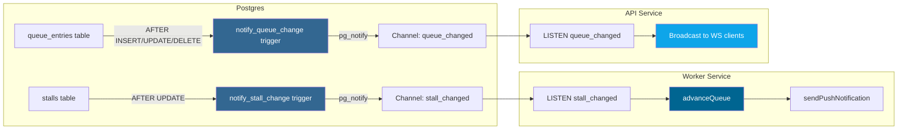
```mermaid
graph LR
    subgraph Postgres
        T1[stalls table]
        TR1[notify_stall_change trigger]
        CH1[Channel: stall_changed]

        T2[queue_entries table]
        TR2[notify_queue_change trigger]
        CH2[Channel: queue_changed]

        T1 -->|AFTER UPDATE| TR1
        TR1 -->|pg_notify| CH1

        T2 -->|AFTER INSERT/UPDATE/DELETE| TR2
        TR2 -->|pg_notify| CH2
    end

    subgraph Worker Service
        L1[LISTEN stall_changed]
        ADV[advanceQueue]
        PUSH[sendPushNotification]

        CH1 --> L1
        L1 --> ADV
        ADV --> PUSH
    end

    subgraph API Service
        L2[LISTEN queue_changed]
        BC[Broadcast to WS clients]

        CH2 --> L2
        L2 --> BC
    end

    style TR1 fill:#336791,color:#fff
    style TR2 fill:#336791,color:#fff
    style ADV fill:#006591,color:#fff
    style BC fill:#0ea5e9,color:#fff
```

### Why Not Poll?

| Approach | Latency | DB Load | Complexity |
|----------|---------|---------|------------|
| Polling every 5s | 0-5s | O(n) queries/interval | Low |
| Long-polling | ~1s | Holds connections | Medium |
| **LISTEN/NOTIFY** | **< 100ms** | **Zero idle cost** | **Medium** |
| External message queue | ~200ms | Adds infra | High |

### Concurrency Safety

```sql
-- Worker uses FOR UPDATE SKIP LOCKED to prevent double-notification
SELECT id, push_sub_id FROM queue_entries
WHERE station_id = $1 AND status = 'waiting'
ORDER BY joined_at ASC
LIMIT 1
FOR UPDATE SKIP LOCKED;
```

This means multiple worker instances can safely run in parallel — each grabs a different entry.

---

## 6. API Surface

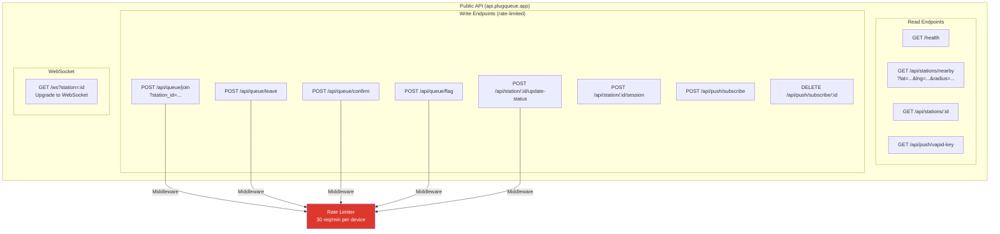
```mermaid
graph TD
    subgraph "Public API (api.plugqueue.app)"

        subgraph "Read Endpoints"
            E1["GET /health"]
            E2["GET /api/stations/nearby<br/>?lat=...&lng=...&radius=..."]
            E3["GET /api/stations/:id"]
            E4["GET /api/push/vapid-key"]
        end

        subgraph "Write Endpoints (rate-limited)"
            E5["POST /api/queue/join<br/>?station_id=..."]
            E6["POST /api/queue/leave"]
            E7["POST /api/queue/confirm"]
            E8["POST /api/queue/flag"]
            E9["POST /api/station/:id/update-status"]
            E10["POST /api/station/:id/session"]
            E11["POST /api/push/subscribe"]
            E12["DELETE /api/push/subscribe/:id"]
        end

        subgraph "WebSocket"
            E13["GET /ws?station=:id<br/>Upgrade to WebSocket"]
        end
    end

    E5 & E6 & E7 & E8 & E9 -->|Middleware| RL[Rate Limiter<br/>30 req/min per device]

    style RL fill:#dc382d,color:#fff
```

### WebSocket Protocol

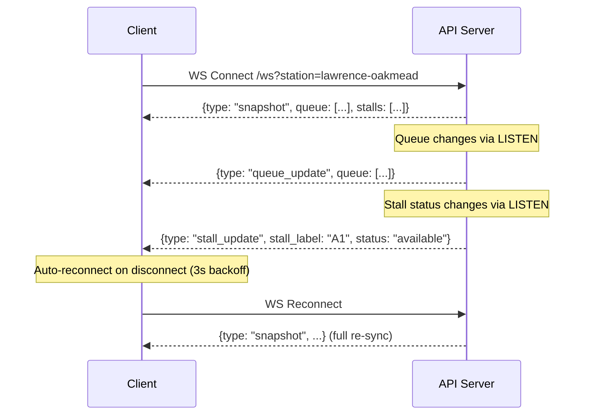
```mermaid
sequenceDiagram
    participant C as Client
    participant S as API Server

    C->>S: WS Connect /ws?station=lawrence-oakmead
    S-->>C: {type: "snapshot", queue: [...], stalls: [...]}

    Note over S: Queue changes via LISTEN
    S-->>C: {type: "queue_update", queue: [...]}

    Note over S: Stall status changes via LISTEN
    S-->>C: {type: "stall_update", stall_label: "A1", status: "available"}

    Note over C: Auto-reconnect on disconnect (3s backoff)
    C->>S: WS Reconnect
    S-->>C: {type: "snapshot", ...} (full re-sync)
```

---

## 7. Frontend Architecture

### 7.1 Component Tree

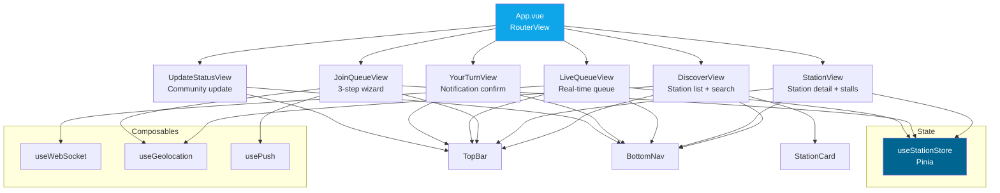
```mermaid
graph TD
    APP[App.vue<br/>RouterView]

    APP --> DV[DiscoverView<br/>Station list + search]
    APP --> SV[StationView<br/>Station detail + stalls]
    APP --> JQ[JoinQueueView<br/>3-step wizard]
    APP --> LQ[LiveQueueView<br/>Real-time queue]
    APP --> YT[YourTurnView<br/>Notification confirm]
    APP --> US[UpdateStatusView<br/>Community update]

    DV --> TB[TopBar]
    DV --> BN[BottomNav]
    DV --> SC[StationCard]

    SV --> TB
    SV --> BN

    JQ --> TB

    LQ --> TB
    LQ --> BN

    YT --> TB
    YT --> BN

    US --> TB
    US --> BN

    subgraph Composables
        WS[useWebSocket]
        GEO[useGeolocation]
        PUSH[usePush]
    end

    subgraph State
        STORE[useStationStore<br/>Pinia]
    end

    LQ --> WS
    DV --> GEO
    JQ --> GEO
    JQ --> PUSH
    SV --> STORE
    JQ --> STORE
    LQ --> STORE

    style APP fill:#0ea5e9,color:#fff
    style STORE fill:#006591,color:#fff
```

### 7.2 Route Map

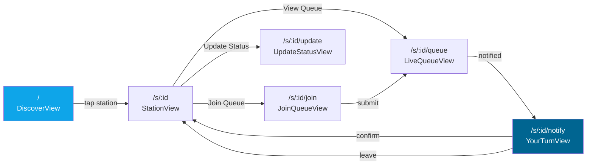
```mermaid
graph LR
    ROOT["/ <br/>DiscoverView"] -->|tap station| STATION["/s/:id<br/>StationView"]
    STATION -->|"Join Queue"| JOIN["/s/:id/join<br/>JoinQueueView"]
    STATION -->|"View Queue"| QUEUE["/s/:id/queue<br/>LiveQueueView"]
    STATION -->|"Update Status"| UPDATE["/s/:id/update<br/>UpdateStatusView"]

    JOIN -->|submit| QUEUE
    QUEUE -->|notified| NOTIFY["/s/:id/notify<br/>YourTurnView"]
    NOTIFY -->|confirm| STATION
    NOTIFY -->|leave| STATION

    style ROOT fill:#0ea5e9,color:#fff
    style NOTIFY fill:#006591,color:#fff
```

### 7.3 State Management (Pinia)

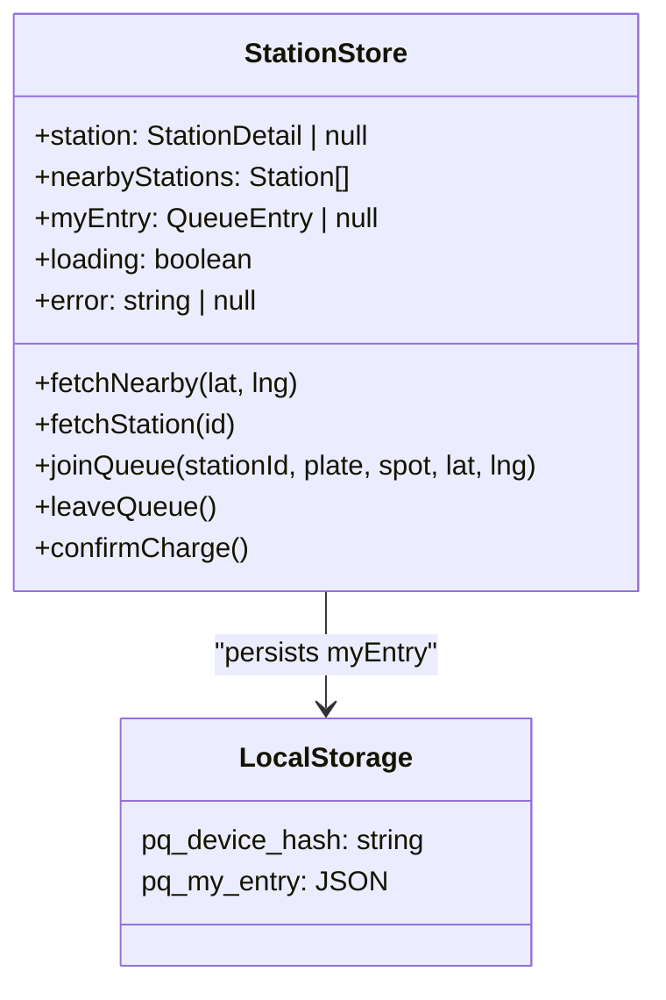
```mermaid
classDiagram
    class StationStore {
        +station: StationDetail | null
        +nearbyStations: Station[]
        +myEntry: QueueEntry | null
        +loading: boolean
        +error: string | null
        +fetchNearby(lat, lng)
        +fetchStation(id)
        +joinQueue(stationId, plate, spot, lat, lng)
        +leaveQueue()
        +confirmCharge()
    }

    class LocalStorage {
        pq_device_hash: string
        pq_my_entry: JSON
    }

    StationStore --> LocalStorage : "persists myEntry"
```

### 7.4 Join Queue Wizard Flow

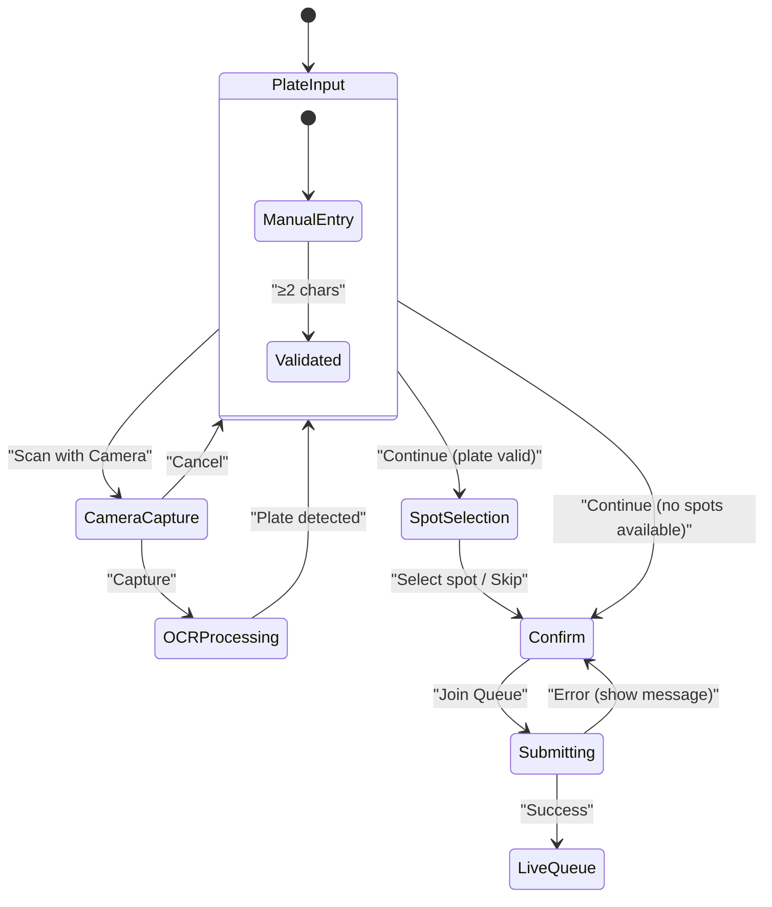
```mermaid
stateDiagram-v2
    [*] --> PlateInput

    PlateInput --> CameraCapture : "Scan with Camera"
    CameraCapture --> OCRProcessing : "Capture"
    OCRProcessing --> PlateInput : "Plate detected"
    CameraCapture --> PlateInput : "Cancel"

    PlateInput --> SpotSelection : "Continue (plate valid)"
    PlateInput --> Confirm : "Continue (no spots available)"

    SpotSelection --> Confirm : "Select spot / Skip"

    Confirm --> Submitting : "Join Queue"
    Submitting --> LiveQueue : "Success"
    Submitting --> Confirm : "Error (show message)"

    state PlateInput {
        [*] --> ManualEntry
        ManualEntry --> Validated : "≥2 chars"
    }
```

---

## 8. Privacy Model

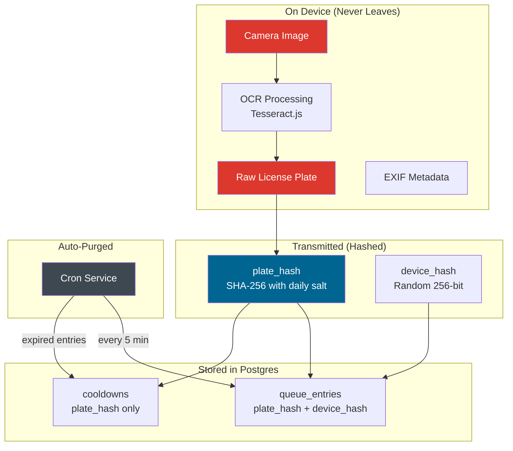
```mermaid
graph TD
    subgraph "On Device (Never Leaves)"
        IMG[Camera Image]
        RAW[Raw License Plate]
        EXIF[EXIF Metadata]
        OCR[OCR Processing<br/>Tesseract.js]

        IMG --> OCR
        OCR --> RAW
    end

    subgraph "Transmitted (Hashed)"
        HASH[plate_hash<br/>SHA-256 with daily salt]
        DEV[device_hash<br/>Random 256-bit]
        RAW --> HASH
    end

    subgraph "Stored in Postgres"
        QE[queue_entries<br/>plate_hash + device_hash]
        CD[cooldowns<br/>plate_hash only]
    end

    HASH --> QE
    DEV --> QE
    HASH --> CD

    subgraph "Auto-Purged"
        CRON[Cron Service]
        CRON -->|"every 5 min"| QE
        CRON -->|"expired entries"| CD
    end

    style IMG fill:#dc382d,color:#fff
    style RAW fill:#dc382d,color:#fff
    style HASH fill:#006591,color:#fff
    style CRON fill:#3e4850,color:#fff
```

**Privacy guarantees:**
- **Plate images** never leave the device — Tesseract.js runs in the browser.
- **Plate text** is hashed with a **daily-rotating salt** before transmission.
- The server stores `plate_hash`, not the plate itself. Two different days produce different hashes for the same plate.
- Queue entries **auto-expire** after 2 hours and are **purged** after 24 hours.
- Cooldowns are keyed by `plate_hash` — they expire when the salt rotates (worst case: midnight boundary).
- **No accounts, no emails, no phone numbers, no login tokens.**

---

## 9. Deployment Topology

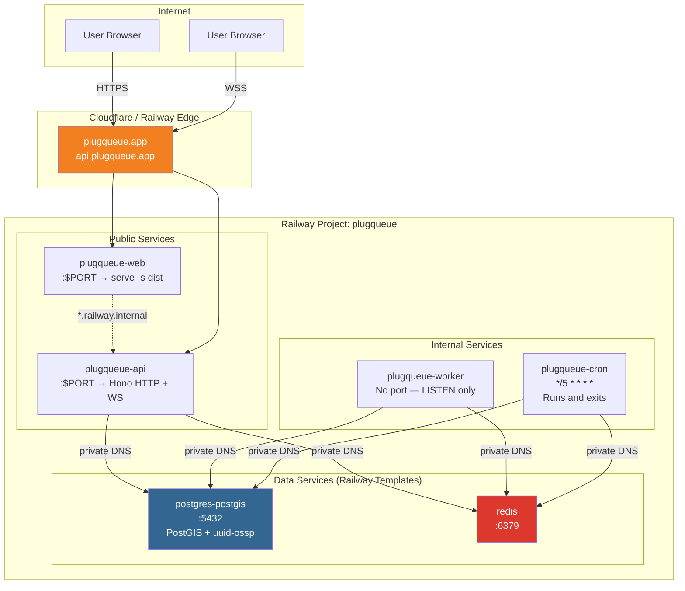
```mermaid
graph TB
    subgraph Internet
        U1[User Browser]
        U2[User Browser]
    end

    subgraph "Cloudflare / Railway Edge"
        DNS["plugqueue.app<br/>api.plugqueue.app"]
    end

    subgraph "Railway Project: plugqueue"
        subgraph "Public Services"
            WEB["plugqueue-web<br/>:$PORT → serve -s dist"]
            API["plugqueue-api<br/>:$PORT → Hono HTTP + WS"]
        end

        subgraph "Internal Services"
            WRK["plugqueue-worker<br/>No port — LISTEN only"]
            CRON["plugqueue-cron<br/>*/5 * * * *<br/>Runs and exits"]
        end

        subgraph "Data Services (Railway Templates)"
            PG["postgres-postgis<br/>:5432<br/>PostGIS + uuid-ossp"]
            RD["redis<br/>:6379"]
        end

        WEB -.->|"*.railway.internal"| API
        API -->|"private DNS"| PG
        API -->|"private DNS"| RD
        WRK -->|"private DNS"| PG
        WRK -->|"private DNS"| RD
        CRON -->|"private DNS"| PG
        CRON -->|"private DNS"| RD
    end

    U1 -->|HTTPS| DNS
    U2 -->|WSS| DNS
    DNS --> WEB
    DNS --> API

    style DNS fill:#f38020,color:#fff
    style PG fill:#336791,color:#fff
    style RD fill:#dc382d,color:#fff
```

### Railway Config per Service

| Service | `railway.json` Key Settings |
|---------|---------------------------|
| `plugqueue-web` | `startCommand: "npx serve -s dist -l $PORT"`, healthcheck `/` |
| `plugqueue-api` | `startCommand: "node dist/index.js"`, healthcheck `/health`, restart ON_FAILURE 3x |
| `plugqueue-worker` | `startCommand: "node dist/index.js"`, restart ALWAYS, no healthcheck |
| `plugqueue-cron` | `cronSchedule: "*/5 * * * *"`, restart NEVER |

### Environment Variables Flow

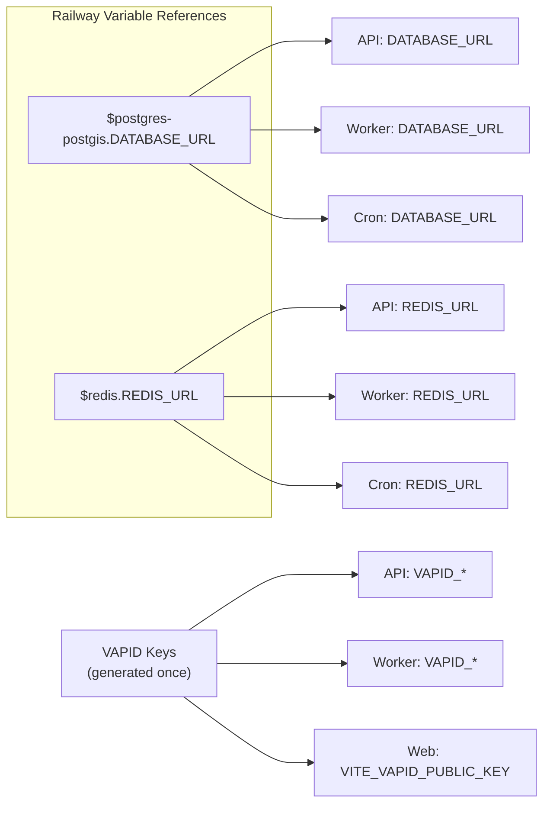
```mermaid
graph LR
    subgraph "Railway Variable References"
        PG_URL["$postgres-postgis.DATABASE_URL"]
        RD_URL["$redis.REDIS_URL"]
    end

    PG_URL --> API_ENV["API: DATABASE_URL"]
    PG_URL --> WRK_ENV["Worker: DATABASE_URL"]
    PG_URL --> CRON_ENV["Cron: DATABASE_URL"]

    RD_URL --> API_ENV2["API: REDIS_URL"]
    RD_URL --> WRK_ENV2["Worker: REDIS_URL"]
    RD_URL --> CRON_ENV2["Cron: REDIS_URL"]

    VAPID["VAPID Keys<br/>(generated once)"] --> API_ENV3["API: VAPID_*"]
    VAPID --> WRK_ENV3["Worker: VAPID_*"]
    VAPID --> WEB_ENV["Web: VITE_VAPID_PUBLIC_KEY"]
```

---

## 10. Queue State Machine

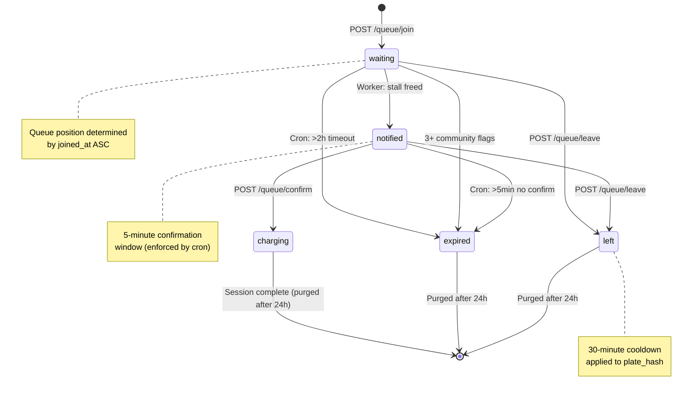
```mermaid
stateDiagram-v2
    [*] --> waiting : POST /queue/join

    waiting --> notified : Worker: stall freed
    waiting --> expired : Cron: >2h timeout
    waiting --> left : POST /queue/leave
    waiting --> expired : 3+ community flags

    notified --> charging : POST /queue/confirm
    notified --> expired : Cron: >5min no confirm
    notified --> left : POST /queue/leave

    charging --> [*] : Session complete (purged after 24h)
    expired --> [*] : Purged after 24h
    left --> [*] : Purged after 24h

    note right of waiting
        Queue position determined
        by joined_at ASC
    end note

    note right of notified
        5-minute confirmation
        window (enforced by cron)
    end note

    note right of left
        30-minute cooldown
        applied to plate_hash
    end note
```

### State Transition Table

| From | To | Trigger | Side Effects |
|------|-----|---------|-------------|
| — | `waiting` | `POST /queue/join` | Geofence check, cooldown check, duplicate check |
| `waiting` | `notified` | Worker LISTEN | Push notification sent, `notified_at` set |
| `waiting` | `expired` | Cron (>2h) | — |
| `waiting` | `expired` | 3+ flags | Auto-moderation |
| `waiting` | `left` | `POST /queue/leave` | 30-min cooldown set |
| `notified` | `charging` | `POST /queue/confirm` | — |
| `notified` | `expired` | Cron (>5min after notify) | Next person notified |
| `notified` | `left` | `POST /queue/leave` | 30-min cooldown set |

---

## 11. Push Notification Flow

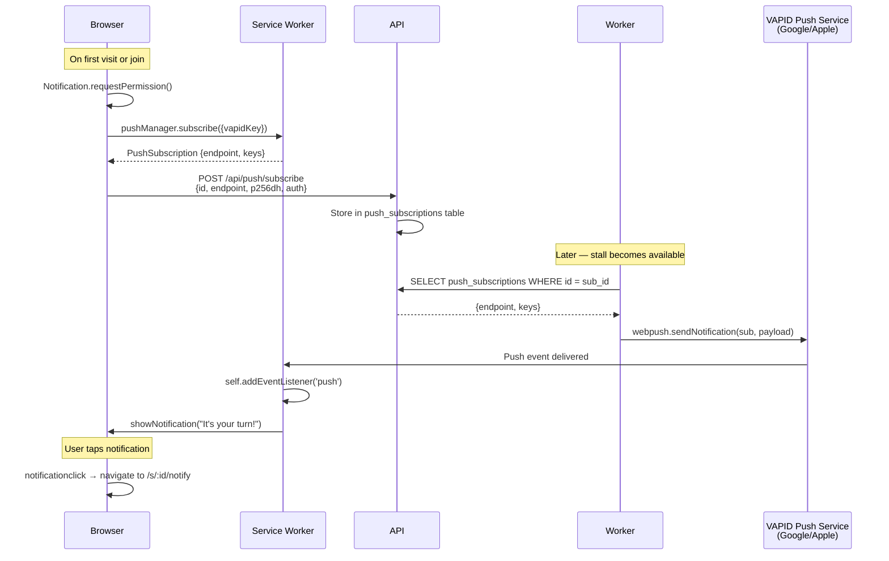
```mermaid
sequenceDiagram
    participant B as Browser
    participant SW as Service Worker
    participant A as API
    participant W as Worker
    participant VP as VAPID Push Service<br/>(Google/Apple)

    Note over B: On first visit or join
    B->>B: Notification.requestPermission()
    B->>SW: pushManager.subscribe({vapidKey})
    SW-->>B: PushSubscription {endpoint, keys}

    B->>A: POST /api/push/subscribe<br/>{id, endpoint, p256dh, auth}
    A->>A: Store in push_subscriptions table

    Note over W: Later — stall becomes available
    W->>A: SELECT push_subscriptions WHERE id = sub_id
    A-->>W: {endpoint, keys}
    W->>VP: webpush.sendNotification(sub, payload)
    VP->>SW: Push event delivered

    SW->>SW: self.addEventListener('push')
    SW->>B: showNotification("It's your turn!")

    Note over B: User taps notification
    B->>B: notificationclick → navigate to /s/:id/notify
```

### iOS PWA Caveats
- Push notifications require the PWA to be **added to Home Screen** on iOS.
- The `standalone` display mode is required.
- Users must grant permission inside the PWA, not from Safari.

---

## 12. OCR Pipeline

```mermaid
graph TD
    subgraph "On-Device (Browser)"
        CAM[Camera API<br/>facingMode: environment]
        CANVAS[Canvas Capture<br/>drawImage from video]
        TESS[Tesseract.js<br/>createWorker eng]
        REGEX[Plate Regex Extraction<br/>"/[A-Z0-9]{2,4}[\s-]?[A-Z0-9]{2,5}/"]
        HASH[SHA-256 Hash<br/>with daily salt]

        CAM --> CANVAS
        CANVAS --> TESS
        TESS --> REGEX
        REGEX --> HASH
    end

    subgraph "Status Screenshot OCR"
        PASTE[Clipboard Paste Event]
        BLOB[Image Blob]
        TESS2[Tesseract.js]
        PARSE[Pattern Matching<br/>"A1: Available"<br/>"#2: In Use"]

        PASTE --> BLOB
        BLOB --> TESS2
        TESS2 --> PARSE
    end

    HASH -->|plate_hash| SERVER[API Server]
    PARSE -->|stall statuses| SERVER

    style TESS fill:#006591,color:#fff
    style TESS2 fill:#006591,color:#fff
    style HASH fill:#3e4850,color:#fff
```

**Two OCR use cases:**
1. **Plate scanning** — camera viewfinder captures plate, Tesseract.js extracts text, regex isolates plate format.
2. **Status screenshots** — user pastes a charging app screenshot, OCR extracts stall statuses (e.g., "Stall 1: Available").

Both run entirely in the browser. No image data is ever transmitted.

---

## 13. Rate Limiting & Anti-Abuse

```mermaid
graph TD
    REQ[Incoming Request] --> DH{x-device-hash<br/>header present?}
    DH -->|No| R400[400: Missing header]
    DH -->|Yes| RL{Redis INCR<br/>rl:{device_hash}}

    RL -->|count ≤ 30| PASS[Continue to handler]
    RL -->|count > 30| R429[429: Rate limited]

    PASS --> CD{Cooldown check<br/>Redis GET cd:{station}:{plate_hash}}
    CD -->|Key exists| R429B[429: Cooldown active]
    CD -->|No key| GEO{Geofence check<br/>ST_Distance ≤ geofence_m}

    GEO -->|Outside| R403[403: Outside geofence]
    GEO -->|Inside| DUP{Duplicate check<br/>SELECT existing entry}

    DUP -->|Exists| R409[409: Already in queue]
    DUP -->|Clean| INSERT[INSERT queue_entry ✓]

    style R400 fill:#dc382d,color:#fff
    style R429 fill:#dc382d,color:#fff
    style R429B fill:#dc382d,color:#fff
    style R403 fill:#dc382d,color:#fff
    style R409 fill:#dc382d,color:#fff
    style INSERT fill:#006591,color:#fff
```

### Anti-Abuse Layers

| Layer | Mechanism | Window |
|-------|-----------|--------|
| Rate limiting | Redis `INCR` + `EXPIRE` | 30 req/min per device |
| Cooldown | Redis `SET EX` + Postgres audit | 30 min after leaving queue |
| Geofence | PostGIS `ST_DWithin` | Must be within station radius |
| Duplicate | Postgres unique constraint | One entry per plate per station |
| Community flagging | 3 flags → auto-expire | Per queue entry |
| EXIF validation | Check photo timestamp | Reject old photos (future) |

---

## 14. Failure Modes & Recovery

```mermaid
graph TD
    subgraph "Failure: Worker crashes"
        WC[Worker process exits]
        WR[Railway restarts<br/>policy: ALWAYS]
        RC[Reconciliation query<br/>on startup]
        CN[Catch-up notifications<br/>for missed events]

        WC --> WR --> RC --> CN
    end

    subgraph "Failure: API WS disconnect"
        AD[API loses LISTEN connection]
        AE[pg client error event]
        AX[process.exit 1]
        AR[Railway restarts]
        AS[Re-subscribe LISTEN<br/>Re-accept WS clients]

        AD --> AE --> AX --> AR --> AS
    end

    subgraph "Failure: Cron misses a run"
        CM[Cron job fails]
        NR[Next run in 5 min]
        ID[Idempotent queries<br/>pick up remaining work]

        CM --> NR --> ID
    end

    subgraph "Failure: Redis down"
        RD[Redis unavailable]
        RL[Rate limits disabled<br/>requests pass through]
        CD[Cooldowns fall back<br/>to Postgres check]

        RD --> RL
        RD --> CD
    end

    style WC fill:#dc382d,color:#fff
    style AD fill:#dc382d,color:#fff
    style CM fill:#dc382d,color:#fff
    style RD fill:#dc382d,color:#fff
    style CN fill:#006591,color:#fff
    style AS fill:#006591,color:#fff
    style ID fill:#006591,color:#fff
```

### Reconciliation Query (Worker Startup)

```sql
-- Find entries that should have been notified
-- but were missed because the worker was down
SELECT qe.*
FROM queue_entries qe
JOIN stalls s ON s.station_id = qe.station_id
WHERE qe.status = 'waiting'
  AND s.current_status = 'available'
  AND s.status_updated_at > qe.joined_at;
```

---

## 15. Design System

The UI follows the **"Glacier"** design system — a glacial, editorial aesthetic with glassmorphism and tonal layering.

### Color Architecture

```mermaid
graph TD
    subgraph "Light Mode Palette"
        BG["Background<br/>#f7f9fb"]
        SC["Surface Container<br/>#eceef0"]
        SCL["Surface Container Lowest<br/>#ffffff"]
        PC["Primary Container<br/>#0ea5e9"]
        P["Primary<br/>#006591"]
        OS["On Surface<br/>#191c1e"]
        OSV["On Surface Variant<br/>#3e4850"]

        BG --> SC --> SCL
    end

    subgraph "Dark Mode Palette"
        DBG["Background<br/>#0a0e1a"]
        DSC["Surface Container<br/>#141c2e"]
        DSCL["Surface Container Lowest<br/>#0a0e1a"]
        DPC["Primary Container<br/>#0e4d6e"]
        DP["Primary<br/>#7dd3fc"]
        DOS["On Surface<br/>#e0e8f0"]
        DOSV["On Surface Variant<br/>#a0b4c4"]

        DBG --> DSC --> DSCL
    end

    style PC fill:#0ea5e9,color:#fff
    style P fill:#006591,color:#fff
    style DP fill:#7dd3fc,color:#001f2e
    style DPC fill:#0e4d6e,color:#c8eaff
    style BG fill:#f7f9fb,color:#191c1e
    style DBG fill:#0a0e1a,color:#e0e8f0
```

### Design Rules

| Rule | Implementation |
|------|---------------|
| **No borders** | Boundaries via background color shifts only |
| **No dividers** | 16px whitespace between list items |
| **Glassmorphism** | `backdrop-filter: blur(12-24px)` + semi-transparent bg |
| **Tonal shadows** | Primary-tinted: `rgba(0, 101, 145, 0.06)` |
| **Full-radius buttons** | `rounded-full` (9999px) for primary actions |
| **Editorial typography** | Display: -0.02em tracking, Labels: ALL CAPS +0.05em |
| **No #000000** | Always use `on-surface` (#191c1e / #e0e8f0) |

### Screen Inventory

| Screen | Route | Key Components |
|--------|-------|----------------|
| Station Discovery | `/` | Map markers, search, station cards with queue/stall counts |
| Station Detail | `/s/:id` | Hero gradient card, stall grid, join/update CTAs |
| Join Queue — Plate | `/s/:id/join` | Camera viewfinder, OCR processing indicator, manual input |
| Join Queue — Spot | `/s/:id/join` | Aerial lot map grid, tap-to-select spots |
| Live Queue | `/s/:id/queue` | Position hero (#N), real-time list via WebSocket |
| Your Turn | `/s/:id/notify` | Full-screen celebration, confirm/leave buttons, 5-min timer |
| Update Status | `/s/:id/update` | Paste screenshot area, stall toggle list, community submit |
| Alerts | — | Push notification cards, ephemeral status banners |

---

## Monorepo Structure

```
plugqueue/
├── apps/
│   ├── web/                        # Vue 3 PWA
│   │   ├── src/
│   │   │   ├── components/         # TopBar, BottomNav, StationCard
│   │   │   ├── views/              # 6 route views
│   │   │   ├── composables/        # useWebSocket, useGeolocation, usePush
│   │   │   ├── stores/             # Pinia station store
│   │   │   ├── lib/                # API client, helpers
│   │   │   ├── router/             # Vue Router config
│   │   │   └── app.css             # Tailwind + Glacier tokens
│   │   ├── public/                 # PWA manifest, lot maps, SW
│   │   └── railway.json
│   ├── api/                        # Hono API + WebSocket
│   │   ├── src/
│   │   │   ├── routes/             # stations, queue, status, push
│   │   │   ├── middleware/         # rate limiting
│   │   │   ├── lib/                # db, redis, hash, push
│   │   │   └── ws/                 # WebSocket handler + LISTEN
│   │   └── railway.json
│   ├── worker/                     # LISTEN/NOTIFY → push delivery
│   │   ├── src/
│   │   │   ├── lib/                # redis, push
│   │   │   └── index.ts            # Main LISTEN loop + reconciliation
│   │   └── railway.json
│   └── cron/                       # Scheduled cleanup
│       ├── src/
│       │   └── index.ts            # 6 cleanup jobs
│       └── railway.json
├── packages/
│   ├── shared/                     # Types + Zod schemas
│   │   └── src/
│   │       ├── types/              # Station, Stall, QueueEntry, WsMessage
│   │       └── schemas/            # joinQueue, updateStatus, etc.
│   └── db/                         # SQL migrations + seed
│       ├── migrations/
│       │   ├── 001_initial.sql     # Tables + indexes
│       │   └── 002_triggers.sql    # LISTEN/NOTIFY functions
│       └── seed.sql                # Lawrence Oakmead + SOMA MegaHub
├── turbo.json
├── package.json                    # npm workspaces + Turborepo
└── .env.example
```
